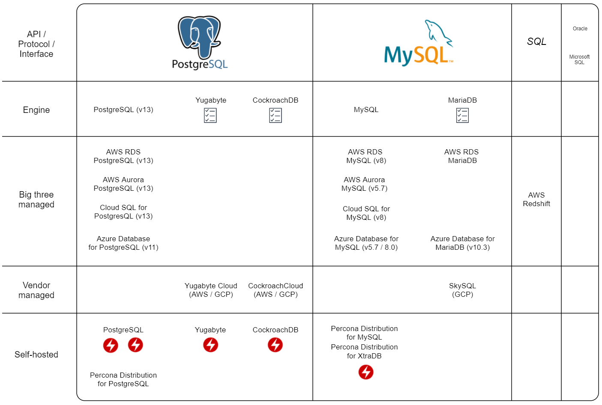
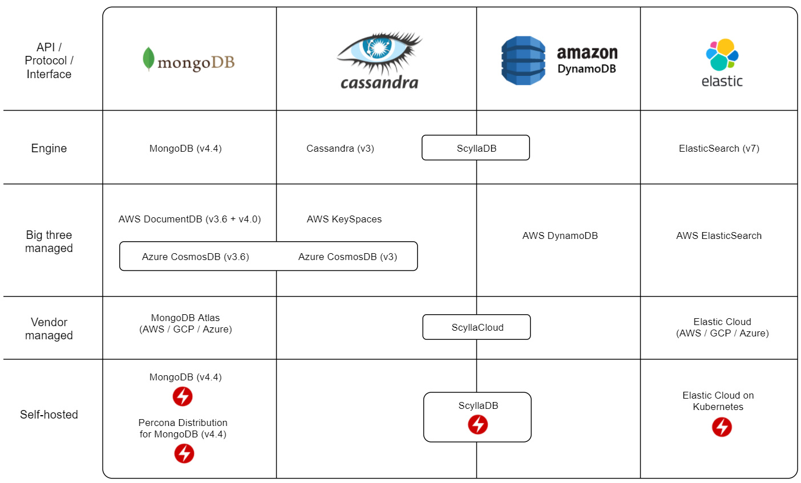
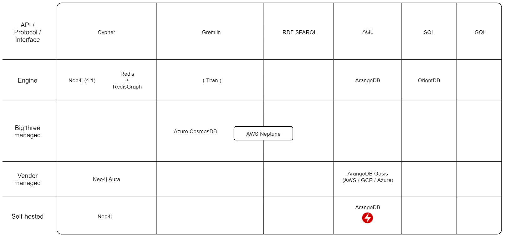

There seems to exist a database for every niche, mood or emotion. And they seem to change just as fast.

How do you balance the urge for the new and shiny but without risking too much headache down the road?

This post is an attempt to lay out the rough landscape of databases that you might encounter or consider as of late 2020.

There will be broad generalizations for brevity.

The goal is not to be exhaustive or take all possible precautions. Consider it a starting point for further research and planning.

<!--more-->
 

---

 

TLDR: Scroll to the [diagrams](#Landscape) or view the [big picture](../images/2020-11-27-end-of-2020-rough-database-landscape/map-complete.png).

 

**Table of contents**

  - [Background](#Background)
    - [Project phase overview](#ProjectPhase)
  - [Planning](#Planning)
    - [Database categories](#DatabaseCategories)
      - [SQL](#SQL)
      - [NoSQL](#NoSQL)
      - [KeyValue](#KeyValue)
      - [Timeseries](#Timeseries)
      - [Graph](#Graph)
      - [Other nice things](#OtherNiceThings)
  - [The Landscape](#Landscape)
      - [SQL](#SQLMap)
      - [NoSQL](#NoSQLMap)
      - [KeyValue](#KeyValueMap)
      - [Timeseries](#TimeseriesMap)
      - [Graph](#GraphMap)
  - [Further reading](#FurtherReading)
  - [Conclusion](#Conclusion)

# Background

I'm a consultant doing development, DevOps and cloud infrastructure. I also have the occational side project trying out the Tech Flavor of the Month.

## Project phase overview
The typical phases in projects I'm involved in follow no scientific or trademarked methodology, so YMMV:

### Starting out

Get something working as fast as possible. Take all the shortcuts. Use some opinionated framework or platform.

### Moving from development to production

People like it, people use it. Move the thing from a single "pet server" to a more robust cloud environment.

### Scaling production

Bottlenecks and scaling problems start to emerge. Refactor or replace some pieces to remove the bottlenecks.

### Challenges

Moving between these phases might be a major PITA if the wrong shortcuts were taken in the previous phases.

*This of course applies to all technology choices and not just databases. But we have to start somewhere, right?*

# Planning

When starting out I try to envision all the phases of the project and which directions it may take in the future.

First I want the technology or software I choose to be instantly usable. A Docker image. Great. An `apt-get install`. Sweet. `npm install`. Sure, why not. Downloading a tarball. Installing some C dependencies. Setting some flags. Compiling. Symlinking and fixing permissions. Creating some configuration from scratch. Making my own systemd service definitions. Going back and doing every step again because it failed. *Mkay, no thanks, I'm out.*

At least for me it's a plus if it's easy to deploy on Kubernetes since I use it for everything already. I always have a cluster or three laying around so I can get a prototype or five up and running quickly before later spending money for cloud hosting.

Does the thing have momentum and a community? If it does it probably has high quality tooling either by the vendor or the open source community (preferrably both). It probably also has lots of common questions answered on blogs and StackOverflow and Github issues.

**So we managed to build something and the audience likes it.**

How easy is it to move it from a production environment into something stable and low-maintenance? For databases that would typically involve using a managed service for hosting it. You do not want to be responsible for operating your own databases. Is it common enough that there are competitors in the marketplace offering it as a managed service? If there is only a single option expect prices to be very steep. Preferrably also a managed service by one of the big known cloud platforms. They are usually cheaper. They are less likely to vanish. It might make integration with other systems easier later.

**We hit some problems either because of raw scale or some type of usage we did not anticipate in the beginning.**

Are there compatible implementations that might solve some common problems? Typically this is because an implementation has to make a descision about it's trade-offs. For a database system this is usually around the CAP theorem. A database system (or anything that keeps state) can be:
 - *Partition Tolerant* - The system still works if a node or the network between nodes fail.
 - *Available* - All requests receive a response.
 - *Consistent* - The data we read is the current data and not an earlier state.

But, you can only have two at the same time. And distributed systems tends to need to be partition tolerant. So we are stuck between consistency and availability.

It might be a good to have an idea of the CAP tradeoffs an implementation has done, and whether there are compatible implementations with different tradeoffs that can be used if later we find out we need to tweak our trade-offs for speed and/or scale.

> *More information about CAP theorem [here](https://en.wikipedia.org/wiki/CAP_theorem) and [here](https://towardsdatascience.com/cap-theorem-and-distributed-database-management-systems-5c2be977950e). Jepsen have also [extensively tested](https://jepsen.io/analyses) many popular databases to see how they break and if they are true to their stated trade-offs.*

## Database categories

Databases can be roughly sorted into categories. I'll keep it simple and use the everyday lingo and not go into details about semantics and definitions (forgive me).

https://www.prisma.io/dataguide/intro/comparing-database-types

### SQL

The oldest category is the relational database, also known as SQL based on the typical interface used to access these databases.

In general these databases have tables with names, a set of pre-defined columns and an arbitrary number of rows. You should have an idea of the data types to be stored in each column (such as text or numbers).

The downside of this is that you have to start with a rough model of the data you want to store and work with. The benefit of this is that later you know something about the model of the data you are working with. Most of the time I'll happily do this in the database rather than handle all the potential inconsistencies in all systems that use that database.

*Main contenders: PostgreSQL. MySQL & MariaDB.*

### NoSQL

All the rage the last decade. You put data in you get data out. The data is structured but not necessarily pre-defined. Think JSON object with values, arrays and lists.

The benefit is productivity when developing. The drawback is that you may pay a price for those shortcuts later if you're not careful.

*Main contender: MongoDB.*

### KeyValue

Technically a sub-category of NoSQL, and should probably be called caches. But I feel it deserves it's own category.

A hyper-fast hyper-simple type of database. It has two columns. A key (ID) and value. The value can be anything, a string, a number, an entire JSON object or a blob containing binary data.

These are typically used in combination with another type of database. Either by storing very commonly used data for even quicker access. Or for certain types of simple data that requires insane speed or throughput and you don't want to overload the main database.

*Main contender: Redis.*

### Timeseries

A lesser known type of database optimized for storing a time series. A time series is a specific data type where the index is typically the time of a measurement. And the measurement is a number.

A time series is almost never changed after the fact. So these databases can be optimized for writing huge amounts of new data and reading and calculating on existing data. At the cost of performance for deleting or updating old data which is sloooow. Since the values are always numbers that tend to change somewhat predictably compression and deduplication can save us massive amounts of storage.

*Main contenders: Prometheus, InfluxDB, TimescaleDB (plugin for PostgreSQL).*

### Graph

Graph databases are cool. In a graph database the relationship between objects are a primary feature. Whereas in SQL you need to join an element from one table with another object in another table with some kind of common identifier.

For most simple use cases a regular SQL database will do fine. But when the number of objects stored (rows) and the number of intermediary tables (joins) become large it gets slow, or expensive, or both.

I don't have much experience with graph databases but I suspect they are less suited to general tasks and should be reserved for solving specific problems.

*Main contenders: Neo4j. Redis + RedisGraph.*

> PS: Graph databases and GraphQL are completely separate things.

### Other nice things

When researching this post I've come across things that look promising but are hard to categorize or fall in their own very niche categories.

 - [Dgraph](https://dgraph.io) - A GraphQL and backend in one.
 - [PrestoDB](https://prestodb.io) - An SQL interface on top of whatever database or storage you want to connect.
 - [RethinkDB](https://rethinkdb.com) - A NoSQL database focused on real-time streaming/updating clients.
 - [FoundationDB](https://www.foundationdb.org) - A transactional key-value store by Apple.
 - [ClickHouse](https://clickhouse.tech/) - An SQL database that stores data (on disk) in columns instead of rows. Makes for blazingly fast analytical and aggregation queries.
 - [Amazon Quantum Ledger Database](https://aws.amazon.com/qldb/) - A managed distributed ledger database (aka blockchain).
 - [EDB Postgres Advanced Server](https://www.enterprisedb.com/products/edb-postgres-advanced-server-secure-ha-oracle-compatible) - An Oracle compatible PostgreSQL variant.

# The Landscape

*How to use these maps:*

Version compatibility are in parenthesis. I have not mapped every version and how much breaking they are compared to previous versions but included some notes where I know there might be issues.

**API/Protocol/Interface** - This is decided by the framework, tool or driver you want to use. Sometimes it might be easier to choose the framework first and then a fitting database protocol. Or you might be lucky to choose the database features you need first and then select frameworks, tools and drivers that support it.

> I think interfaces are really important when creating and choosing technology. I had a [presentation](https://speakerdeck.com/stianovrevage/avoiding-lock-in-without-avoiding-managed-services) about it a while ago and I think it's still relevant.

**Engine** - Database implementations that are independent but try to be compatible. If there are alternatives to the "original" implementation they might have done different tradeoffs with regards to the CAP theorem or solve other specific problems.

**Big three managed** - Available managed services by the big three clouds, Amazon (AWS), Google (GCP) or Microsoft (Azure). Having an option to host in the big three is most likely the cheapest method as well as having a variety of other managed services to build a complete system in a single cloud.

**Vendor managed** - If the database vendor or backing company offers an Official managed service. They are usually hosted on the big three. Potentially a large cost premium over the raw compute power.

**Self-hosted** - Implementations you can run on your own computer or server.

 <table style="text-align:center;"><tr><td colspan="2">**Legend**</td></tr><tr><td width="50px" ></td><td>The checklist icon marks potential compatibility issues. For most use cases not a problem. But keep in mind. **PS:** The absence of this icon does not automatically mean compatibility.</td></tr>
<tr><td></td><td>I put the lightning icon on the self-hosted implementations that have what seems to be stable Kubernetes operators available. In short, a Kubernetes operator makes running a stateful system, such as a database, on Kubernetes much easier. It might allow for longer time before migrating to a managed system.</td></tr>
</table>

## SQL

  

 

> Compatibility:
> - [PostgreSQL - Yugabyte](https://blog.yugabyte.com/postgresql-compatibility-in-yugabyte-db-2-0/)
> - [PostgreSQL - CockroachDB](https://www.cockroachlabs.com/docs/stable/postgresql-compatibility.html)
> - [MySQL - MariaDB](https://mariadb.com/kb/en/mariadb-vs-mysql-compatibility/) 

>Kubernetes Operators:
> - [PostgreSQL (CrunchyData)](https://github.com/CrunchyData/postgres-operator)
> - [PostgreSQL (Zalando)](https://github.com/zalando/postgres-operator)
> - [Yugabyte](https://docs.yugabyte.com/latest/deploy/kubernetes/single-zone/oss/yugabyte-operator/)
> - [CockroachDB](https://github.com/cockroachdb/cockroach-operator)
> - [Percona PostgreSQL for MySQL & XtraDB](https://www.percona.com/software/percona-kubernetes-operators)

## NoSQL

  

 

> PS: There are some [breaking changes](https://docs.mongodb.com/manual/release-notes/4.0-compatibility/) from MongoDB 3.6 to 4 so make sure the tools you intend to use are compatible with the database version you intend on using.

> Kubernetes Operators:
> - [MongoDB](https://github.com/mongodb/mongodb-kubernetes-operator)
> - [Percona Distribution for MongoDB](https://www.percona.com/doc/kubernetes-operator-for-psmongodb/index.html)
> - [ScyllaDB](https://github.com/scylladb/scylla-operator)
> - [Elastic Stack](https://www.elastic.co/guide/en/cloud-on-k8s/current/k8s-overview.html)

## KeyValue

  

 

>Kubernetes Operators:
> - [Redis (Spotahome)](https://github.com/spotahome/redis-operator)

## Timeseries

  

 

>Kubernetes Operators:
> - [Prometheus-Stack](https://github.com/prometheus-community/helm-charts/tree/main/charts/kube-prometheus-stack)
> - [VictoriaMetrics](https://github.com/VictoriaMetrics/operator)

## Graph

  

 

>Kubernetes Operators:
> - [ArangoDB](https://www.arangodb.com/docs/stable/deployment-kubernetes-usage.html)

# Further reading

 - [Wikipedia on RDBMS](https://en.wikipedia.org/wiki/Comparison_of_relational_database_management_systems)
 - [DB-engines.com](https://db-engines.com/en/) - Lots of statistics and comparisons between DB engines
 - [CNCF Landscape](https://landscape.cncf.io/) - What's moving in the cloud native landscape, including databases.

# Conclusion

Congratulations if you made it this far!

I did this research primarily to reduce my own analysis paralysis on various projects so I can get-back-to-building. If you learned something as well, great stuff!

