Quite often people ask me what I actually do. I have a hard time giving a short answer. Even to colleagues and friends in the industry.

Here I will try to show and tell how I spent an evening digging around in a system I helped build for a client.

<!--more-->
 

---

 

**Table of contents**

  - [Background](#Background)
  - [The (initial) problem](#TheProblem)
    - [Fixing the (initial) problem](#FurtherReading)
    - [Verifying the (initial) fix](#FurtherReading)
      - [Baseline simple request - HTTP1 1 connections, 20000 requests](#FurtherReading)
      - [Baseline complex request - HTTP1 1 connections, 20000 requests](#FurtherReading)
    - [Verifying the fix for assumed workload](#FurtherReading)
      - [Complex request - HTTP1 6 connections, 500 requests](#FurtherReading)
      - [Complex request - HTTP2 500 "connections", 500 requests](#FurtherReading)
  - [Side quest: Database optimizations](#FurtherReading)
  - [Determining the next bottleneck](#FurtherReading)
  - [Side quest: Cluster resources and burstable VMs](#FurtherReading)
  - [Conclusion](#Conclusion)

# Background

I'm a consultant doing development, DevOps and cloud infrastructure.

For this specific client I mainly develop APIs using Golang to support new products and features as well as various exporting, importing and processing of data in the background.

I'm also the "ops" guy handling everything in AWS, setting up and maintaing databases, making sure the "DevOps" works and the frontend and analytics people can do their work with little friction.
99% of the time things work just fine. No data is lost. The systems very rarely have unforeseen downtime and the users can access the data they want with acceptable latency rarely exceeding 500ms.

A couple of times a year I assess the status of the architecture and set up new environments from scratch and update any documentation that has drifted. This is also a good time to do changes and add or remove constraints in anticipation of future business needs.

In short, the current tech stack that has evolved over a couple of years is:
 - Everything hosted on Amazon Web Services (AWS).
 - AWS managed Elastic Kubernetes Service (EKS) currently on K8s 1.18.
 - GitHub Actions for building Docker images for frontends, backends and other systems.
 - AWS Elastic Container Registry for storing Docker images.
 - Deployment of each system defined as a Helm chart alongside source code.
 - Actual environment configuration (Helm values) stored in repo along source code. Updated by GitHub Actions.
 - ArgoCD in cluster to manage status of all environments and deployments. Development environments usually automatically deployed on change. Push a button to deploy to Production.
 - Prometheus for storing metrics from the cluster and nodes itself as well as custom metrics for our own systems.
 - Loki for storing logs. Makes it easier to retrieve logs from past Pods and aggregate across multiple Pods.
 - Elastic APM server for tracing.
 - Pyroscope for live CPU profiling/tracing of Go applications.
 - Betteruptime.com for tracking uptime and hosting status pages.

I might write up a longer post about the details if anyone is interested.

# The (initial) problem

A week ago I upgraded our API from version 1, that was deployed in January, to version 2 with new features and better architecture.

One of the endpoints of the API returns an analysis of an object we track. I have previously reduced the amount of database queries by 90% but it still requires about 50 database calls from three different databases.
Getting and analyzing the data usually completes in about 3-400 milliseconds returning an 11.000 line JSON.

It's also possible to just call `/objects/analysis` to get the analysis for all the 500 objects we are tracking. It takes 20 seconds but is meant for exports to other processes and not interactive use, so not a problem.

Since the product is under very active development the frontend guys just download the whole analysis for an object to show certain relevant information to users. It's too early to decide on which information is needed more often and how to optimize for that. Not a problem.

So we need an overview of some fields from multiple objects in a dashboard / list. We can easily pull analysis from 20 objects without any noticable delay.

But what if we just want to show more, 50? 200? 500? The frontend already have the IDs for all the objects and fetches them from `/objects/id/analysis`. So they loop over the IDs and fire of requests simultaneously.

Analyzing the network waterfall in Chrome DevTools indicated that the requests now took 20-30 seconds to complete! But looking closer most of the time they were actually queued up in the browser. This is because
Chrome only allows 6 concurrent TCP connection to the same origin when using HTTP1 (https://developers.google.com/web/tools/chrome-devtools/network/understanding-resource-timing).

## Fixing the (initial) problem

HTTP2 should fix this problem easily. By default HTTP2 is disabled in nginx-ingress. I add a couple of lines enabling it and update the Helm deployment of the ingress controller.

## Verifying the (initial) fix

Some common development tools doesn't support HTTP2, such as Postman. So I found `h2load` which can both help me verify HTTP2 is working and I also get to measure the improvement, nice!

> Note that I'm not using the analysis endpoint since I want to measure the change from HTTP1 to HTTP2 and it will become apparent later that there are other bottlenecks preventing us from a linear performance increase when just changing from HTTP1 to HTTP2.

> Also note that this is somewhat naive since it requests the same URL over and over which can give false results due to any caching. But fortunately we don't do any caching yet.

### Baseline simple request - HTTP1 1 connections, 20000 requests

Using 1 concurrent streams, 1 client and HTTP1 I get an estimate of performance pre-http2:

    h2load --h1 --requests=20000 --clients=1 --max-concurrent-streams=1 https://api.x.com/api/v1/objects/1

The results are as expected:

    finished in 1138.99s, 17.56 req/s, 18.41KB/s
    requests: 20000 total, 20000 started, 20000 done, 19995 succeeded, 5 failed, 0 errored, 0 timeout

<a href="../images/2021-03-06-a-side-quest-in-api-dev-operations-cloud-and-database/0-baseline-http1-1-concurrent-apm.png">
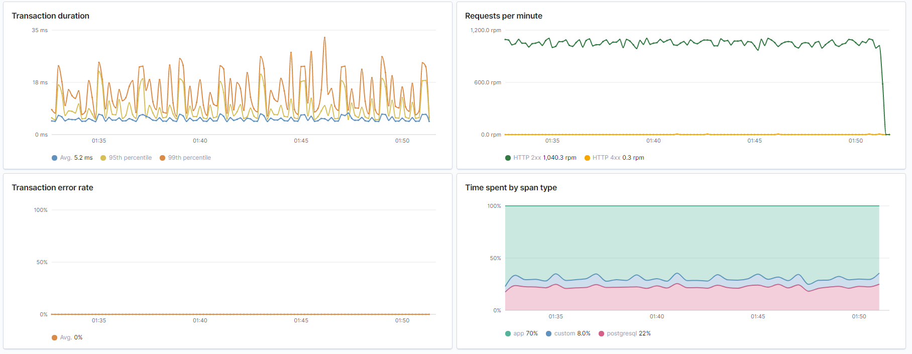
</a>

_Overview from Elastic APM. Duration is very acceptable at around 20ms. No errors. And about 25% of the time spent doing database queries._

<a href="../images/2021-03-06-a-side-quest-in-api-dev-operations-cloud-and-database/0-baseline-http1-1-concurrent-cpu.png">
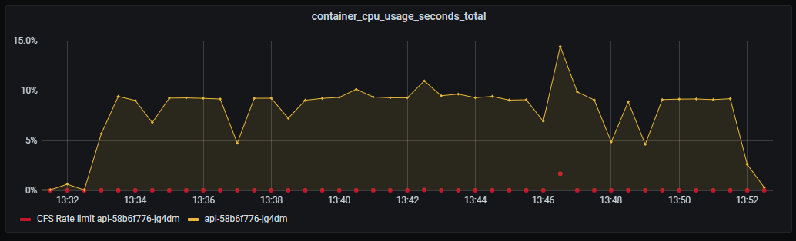
</a>

_Container CPU usage. Nothing special._

_Database query latency. The vast majority under 5ms. Acceptable._

<a href="../images/2021-03-06-a-side-quest-in-api-dev-operations-cloud-and-database/0-baseline-http1-1-concurrent-db-queries.png">
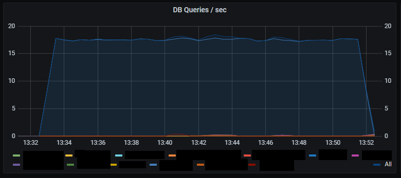
</a>

_Number of DB queries per second._

<a href="../images/2021-03-06-a-side-quest-in-api-dev-operations-cloud-and-database/0-baseline-http1-1-concurrent-http-latency.png">
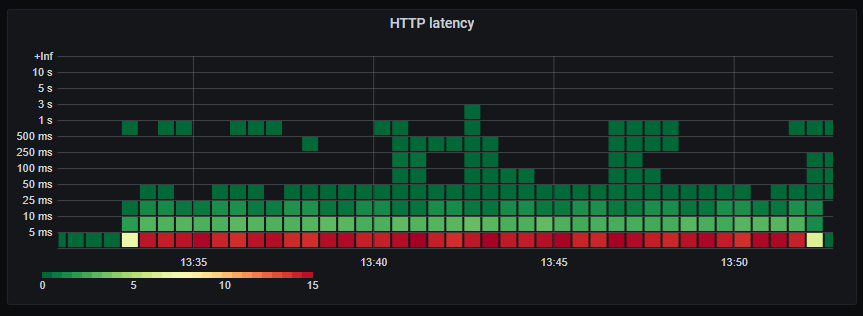
</a>

_HTTP response latency._

<a href="../images/2021-03-06-a-side-quest-in-api-dev-operations-cloud-and-database/0-baseline-http1-1-concurrent-http-requests.png">
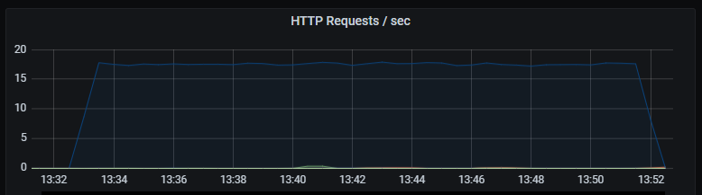
</a>

_Number of HTTP requests per second. Unsurprisingly the number of database queries are identical to the number of HTTP requests. Latency of HTTP requests also tracks the latency of the (single) database query._

For http2 we set max concurrent streams to the same as number of requests:

    h2load --requests=200 --clients=1 --max-concurrent-streams=200 https://api.x.com/api/v1/objects/1

Which results in almost half the latency:

    finished in 1.23s, 162.65 req/s, 158.06KB/s
    requests: 200 total, 200 started, 200 done, 200 succeeded, 0 failed, 0 errored, 0 timeout

So HTTP2 is working and providing significant latency improvements. Success!

### Baseline complex request - HTTP1 1 connections, 20000 requests

We start by establishing a baseline with 1 connection querying over and over.

    h2load --h1 --requests=20000 --clients=1 --max-concurrent-streams=1

<a href="../images/2021-03-06-a-side-quest-in-api-dev-operations-cloud-and-database/1-baseline-http1-1-concurrent-analysis-apm.png">
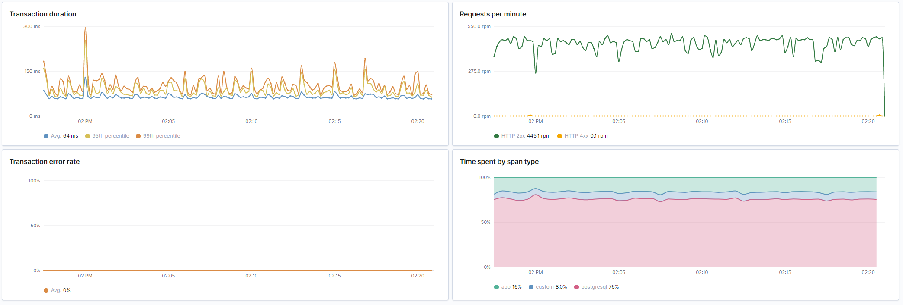
</a>

_Latency increases as much more computation is done and data is returned. But the latency is consistent which is good. We also see that the database is becomming the bottleneck for where most time is spent._

<a href="../images/2021-03-06-a-side-quest-in-api-dev-operations-cloud-and-database/1-baseline-http1-1-concurrent-analysis-cpu.png">
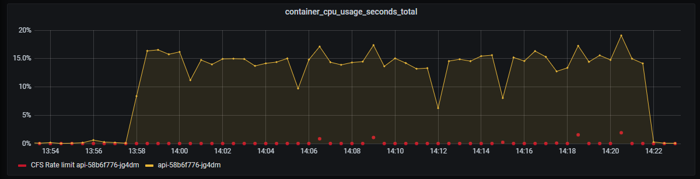
</a>

_CPU usage increased to 15%. Lower increase than expected considering the complexity involved in serving the requests._

<a href="../images/2021-03-06-a-side-quest-in-api-dev-operations-cloud-and-database/1-baseline-http1-1-concurrent-analysis-db-latency.png">
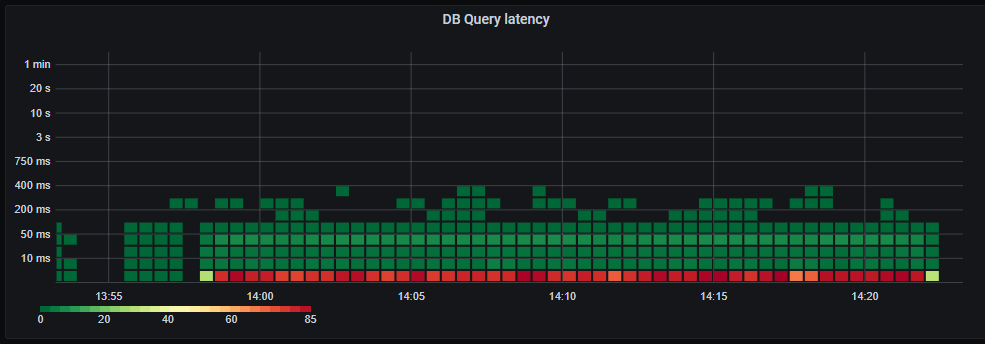
</a>

_Database query latency still mostly under 5ms._

<a href="../images/2021-03-06-a-side-quest-in-api-dev-operations-cloud-and-database/1-baseline-http1-1-concurrent-analysis-db-queries.png">
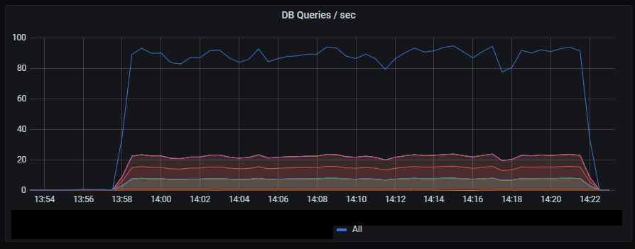
</a>

_Number of database queries increases by a factor of 10 compared to HTTP requests._

<a href="../images/2021-03-06-a-side-quest-in-api-dev-operations-cloud-and-database/1-baseline-http1-1-concurrent-analysis-http-latency.png">
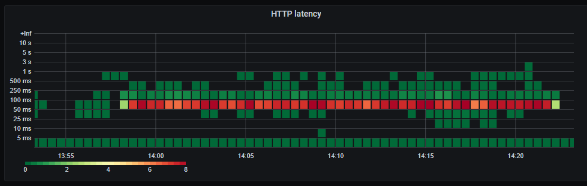
</a>

_HTTP latency._

<a href="../images/2021-03-06-a-side-quest-in-api-dev-operations-cloud-and-database/1-baseline-http1-1-concurrent-analysis-http-requests.png">
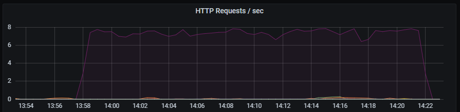
</a>

_HTTP requests per second._

## Verifying the fix for assumed workload

So we verified that HTTP2 gives us a performance boost. But what happens when we fire away 500 requests to the much heavier `/analysis` endpoint?

> These graphs are not as pretty since the ones above. This is mainly due to the sampling interval of the metrics and that we need several datapoints to accurately determine the rate() of a counter.

### Complex request - HTTP1 6 connections, 500 requests

    finished in 32.25s, 14.88 req/s, 2.29MB/s
    requests: 500 total, 500 started, 500 done, 500 succeeded, 0 failed, 0 errored, 0 timeout

<a href="../images/2021-03-06-a-side-quest-in-api-dev-operations-cloud-and-database/2-burst-http1-6-concurrent-analysis-apm.png">
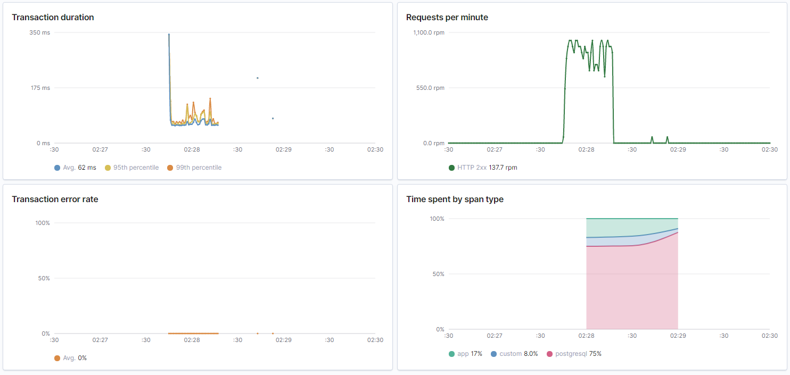
</a>

<a href="../images/2021-03-06-a-side-quest-in-api-dev-operations-cloud-and-database/2-burst-http1-6-concurrent-analysis-db-latency.png">
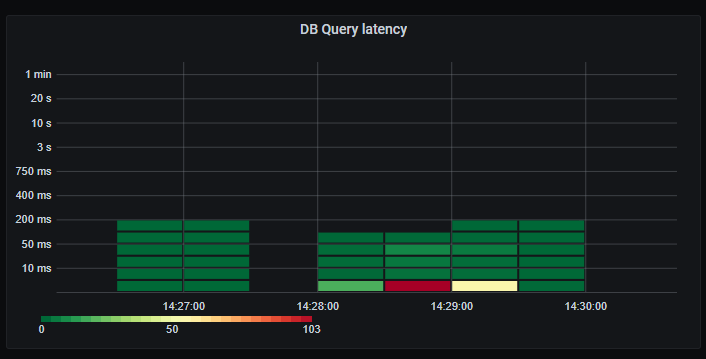
</a>
<a href="../images/2021-03-06-a-side-quest-in-api-dev-operations-cloud-and-database/2-burst-http1-6-concurrent-analysis-db-queries.png">
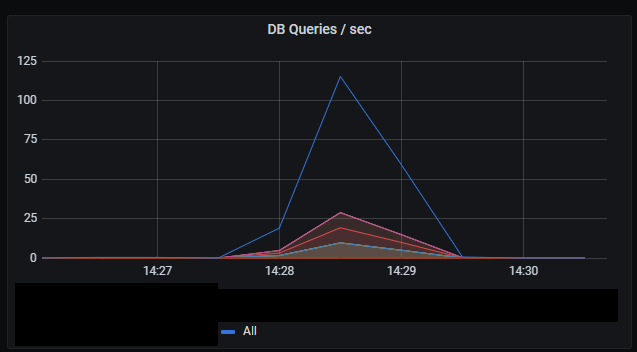
</a>
<a href="../images/2021-03-06-a-side-quest-in-api-dev-operations-cloud-and-database/2-burst-http1-6-concurrent-analysis-http-latency.png">
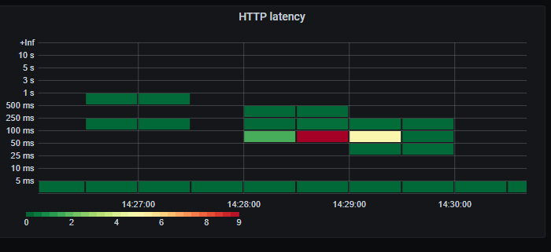
</a>
<a href="../images/2021-03-06-a-side-quest-in-api-dev-operations-cloud-and-database/2-burst-http1-6-concurrent-analysis-http-requests.png">
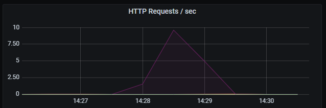
</a>

In summary it so far seems to scale linearly with load. Most of the time is spent fetching data from the database. Still very predictable low latency on database queries and the resulting HTTP response.

### Complex request - HTTP2 500 "connections", 500 requests

_So now we unleash the beast. Firing all 500 requests at the same time._

    finished in 16.66s, 30.02 req/s, 3.55MB/s
    requests: 500 total, 500 started, 500 done, 500 succeeded, 0 failed, 0 errored, 0 timeout

<a href="../images/2021-03-06-a-side-quest-in-api-dev-operations-cloud-and-database/3-burst-http2-500-concurrent-analysis-cpu.png">
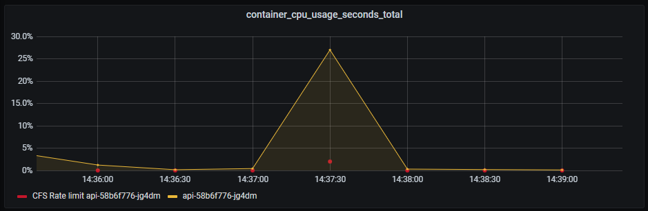
</a>

_CPU on API still doing good. A slight hint of CPU throttling due to CFS, which is used when you set CPU limits in Kubernetes._

> Important about Kubernetes and CPU limits 
> Even with CPU limits set to 1 (100% of one CPU), your container can still be throttled at much lower CPU usage. Check out [this article](https://medium.com/omio-engineering/cpu-limits-and-aggressive-throttling-in-kubernetes-c5b20bd8a718) for more information.

<a href="../images/2021-03-06-a-side-quest-in-api-dev-operations-cloud-and-database/3-burst-http2-500-concurrent-analysis-db-latency.png">
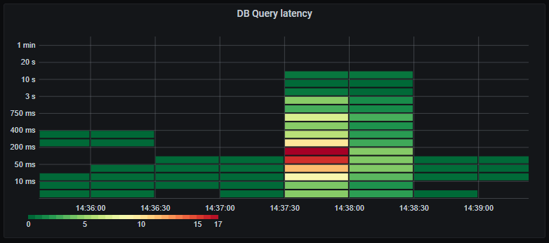
</a>

_Whopsie. The average database query latency has increased drastically, and we have a long tail of very slow queries. Looks like we are starting to see signs of bottlenecks on the database. This might also be affected by our maximum of 60 concurrent connections to the database, resulting in queries having to wait their turn before executing._

<a href="../images/2021-03-06-a-side-quest-in-api-dev-operations-cloud-and-database/3-burst-http2-500-concurrent-analysis-db-queries.png">
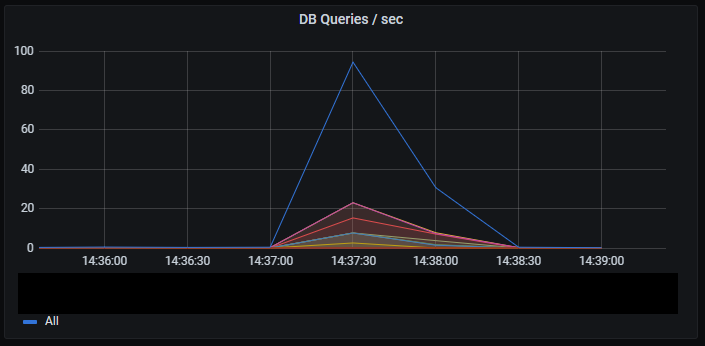
</a>

_It's hard to judge the peak rate of database queries due to limited sampling of the metrics._

<a href="../images/2021-03-06-a-side-quest-in-api-dev-operations-cloud-and-database/3-burst-http2-500-concurrent-analysis-http-latency.png">
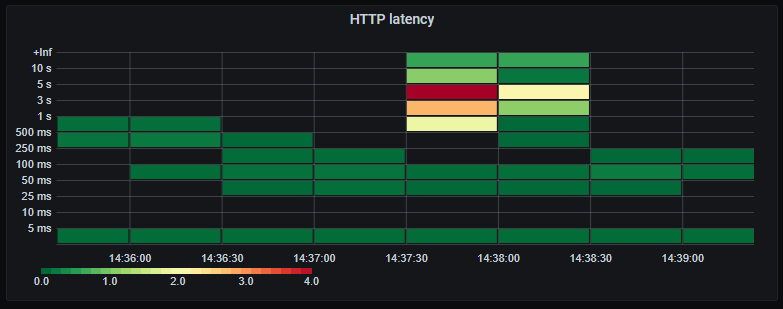
</a>

_Now individual HTTP requests are much slower due to waiting for the database._

<a href="../images/2021-03-06-a-side-quest-in-api-dev-operations-cloud-and-database/3-burst-http2-500-concurrent-analysis-apm-trace.png">
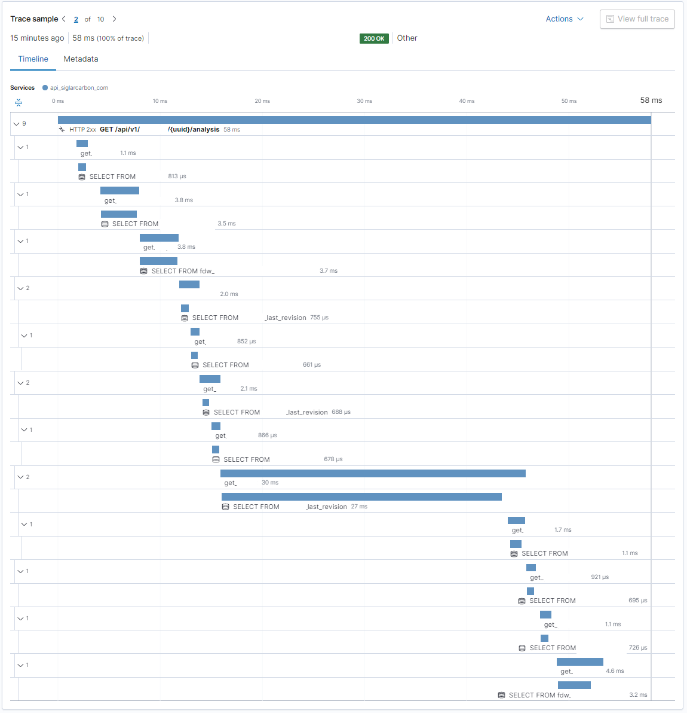
</a>

_Here is just a random trace from Elastic APM to see if the increased database latency is concentrated to specific queries or tables or just general saturation. Indeed there is a single query responsible for half the time taken for the entire query! We better get back to that in a bit and dig further._

In an ideal world all 500 requests should start and complete in 2-300ms regardless. Since that is not happening it's an indication that we are now hitting some other bottleneck.

Looking at the graphs it seems we are starting to saturate the database. The latency for every request is now largely dependent on the slowest of the 10-12 database queries it depends on. And as we are stressing the database the probability of slow queries increase. The latency for the whole process of fetching 500 requests are again largely dependent on the slowest requests.

So this optimization gives on average better performance, but more variability of the individual requests, when the system is under heavy load.

# Side quest: Database optimizations

It seems we are saturating the database. Before throwing more money at the problem (by increasing database size) I like to know what the bottlenecks are. Looking at the traces from APM
I see one query that is consistently taking 10x longer than the rest. I also confirm this in the AWS RDS Performance Insights that show the top SQL queries by load.

When designing the database schema I came up with the idea of having immutability for certain data types. So instead of overwriting row with ID 1, we add a row with ID 1 Revision 2. Now we have the history of who did what to the data and can easily track changes and roll back if needed. The most common use case is just fetching the last revision. So for simplicity I created a PostgreSQL view that only shows the last revision. That way clients don't have to worry about the existense of revisions at all. That is now just an implementation detail.

When it comes to performance that turns out to be an important implementation detail. The view is using `SELECT DISTINCT ON (id) ... ORDER BY id, revision DESC`. However many of the queries to the view is ordering the returned data by time, and expect the data returned from database to already be ordered chronologically. Using `EXPLAIN ANALYZE` on the queries this always results in a full table scan instead of using indexes, and is what's causing this specific query to be slow. Without going into details it seems there is no simple and efficient way of having a view with the last revision and query that for a subset of rows ordered again by time.

For the forseable future this does not actually impact real world usage. It's only apparent under artificially large loads under the worst conditions. But now we know where we need to refactor things if performance actually becomes a problem.

# Determining the next bottleneck

Whenever I fix one problem I like to know where, how and when the next problem or limit is likely to appear. When increasing the number of requests and streams I expected to see increasing latency. But instead I see errors appear like a cliff:

    finished in 27.33s, 36.59 req/s, 5.64MB/s
    requests: 5000 total, 1002 started, 1002 done, 998 succeeded, 4002 failed, 4000 errored, 0 timeout

Consulting the logs for both the nginx load balancer and the API there are no records of failing requests. Since nginx does not pass the HTTP2 connection directly to the API, but instead "unbundles" them into HTTP1 requests I suspect there might be issues with connection limits or even available ports from nginx to the API. But maybe it's a configuration issue. By default nginx does [not limit the number of connections to a backend](http://nginx.org/en/docs/http/ngx_http_upstream_module.html#server) (our API). . But, there is actually a [default limit to the number of HTTP2 requests that can be served over a single connection](https://nginx.org/en/docs/http/ngx_http_v2_module.html#http2_max_requests) - And it happens to be 1000.

I leave it at that. It's very unlikely we'll be hitting these limits any time soon.

# Side quest: Cluster resources and burstable VMs

When load testing the first time around sometimes Grafana would also become unresponsive. That's usually a bad sign. It might indicate that the underlying infrastructure is also reaching saturation. That is not good since it can impact what should be independent services.

Our Kubernetes cluster is composed of 2x t3a.medium on demand nodes and 2x t3a.medium spot nodes. These VM types are burstable. You can use 20% per vCPU sustained over time without problems. If you exceed those 20% you start consuming CPU credits faster than they are granted and once you run out of CPU credits processes will be forcibly throttled.

Of course Kubernetes does not know about this and expects 1 CPU to actually be 1 CPU. In addition Kubernetes will decide where to place workloads based on their stated resource requirements and limits, and not their actual resource usage.

When looking at the actual metrics two of our nodes are indeed out of CPU credits and being throttled. The sum of factors leading to this is:
 - We have not yet set resource requests and limits making it harder for Kubernetes to intelligently place workloads
 - Using burstable nodes having some additional constraints not visible to Kubernetes
 - Old deployments laying around consuming unnecessary resources
 - Adding costly features without assessing the overall impact

I have not touched on the last point yet. I started adding [Pyroscope](https://pyroscope.io/) to our systems since I simply love monitoring All The Things. The documentation does not go into specifics but emphasizes that it's "low overhead". Remember that our budget for CPU usage is actually 40% per node, not 200%. The Pyroscope server itself consumes 10-15% CPU which seems fair. But investigating further the Pyroscope agent also consumes 5-6% CPU per instance. This graph shows the CPU usage of a single Pod before and after turning of Pyroscope profiling.

5-6% CPU overhead on a highly utilized service is probably worth it. But when the baseline CPU usage is 0% CPU and we have multiple services and deployments in different environments we are suddenly using 40-60% CPU on profiling and less than 1% on actual work!

The outcome of this is that we need to separate burstable and stable load deployments. Monitoring and supporting systems are usually more stable resource wise while the actual business systems much more variable, and suitable for burst nodes. In practice we add a node pool of non-burst VMs and use NodeAffinity to stick Prometheus, Pyroscope etc to those nodes. Another benefit of this is that the supporting systems needed to troubleshoot problems are now less likely to be impacted by the problem itself, making troubleshooting much easier.

# Conclusion

This whole adventure only took a few hours but resulted in some specific and immediate performance gains. It also highlighted the weakest links in our application, database and infrastructure architecture.
